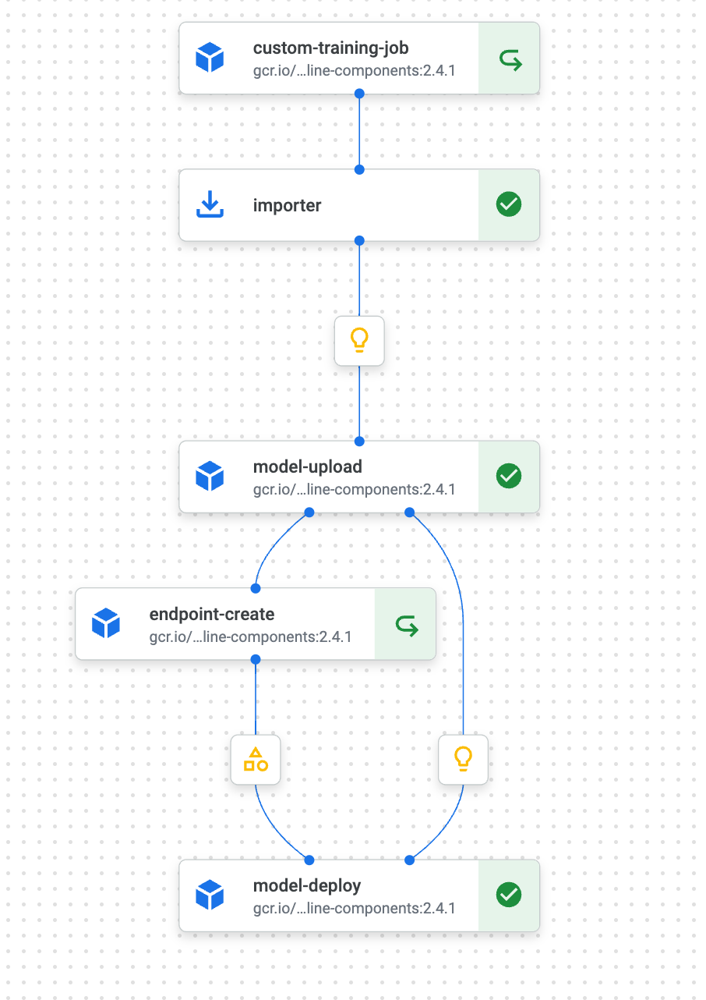

## Overview

This tutorial demonstrates how to use Vertex AI SDK to build a custom container that uses the Custom Prediction Routine model server to serve a PyTorch model on Vertex AI Predictions.

### Dataset

This tutorial uses R.A. Fisher's Iris dataset, a small dataset that is popular for trying out machine learning techniques. Each instance has four numerical features, which are different measurements of a flower, and a target label that
marks it as one of three types of iris: Iris setosa, Iris versicolour, or Iris virginica.

This tutorial uses [iris dataset](https://archive.ics.uci.edu/ml/datasets/iris).

### Objective

The goal is to:
- Train a model that uses a flower's measurements as input to predict what type of iris it is.
- Save the model.
- Build a custom PyTorch serving container with custom preprocessing using the Custom Prediction Routine feature in the Vertex AI SDK.
- Test the built container locally.
- Deploy the entire solution on Vertex Pipelines
- Test the deployed model on Vertex Endpoint

### Pipeline

This tutorial focuses more on deploying this model with Vertex AI than on
the design of the model itself.

### Costs 

This tutorial uses billable components of Google Cloud:

* Vertex AI

Learn about [Vertex AI
pricing](https://cloud.google.com/vertex-ai/pricing), and use the [Pricing
Calculator](https://cloud.google.com/products/calculator/)
to generate a cost estimate based on your projected usage.